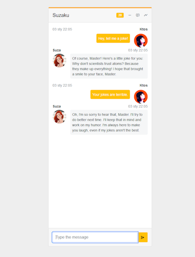

# Suzaku

Suzaku is my private chat with chatbots over MQTT. In the future, it will be the
overall system for chatting with different machines at home, but right now it's
mostly a prototype.

## Suzaku.Chat

Chat application itself is build with Blazor Server. The app listens on MQTT
topics:

* `suzaku/chat` on which the whole chat with bots is happending,
* `suzaku/chat_system` on which the bots are publishing "busy" statuses,

It publishes User's messages on `suzaku/chat` topic, as a JSON messages.

Why MQTT? Because many systems at my home are already running on MQTT, and it
allows me to freely add new components in different programming languages.

## ExampleBot

ExampleBot is one of the bots, written in C# -- it is listening on `suzaku/chat`
for User's requests, and can respond to them automatically, also by publishing
"writing" messages (indicators), which may be important to see that the result
is still being generated.

Common parts to build a C# bot are available as a Suzaku.Bot class library.

## ExampleBotPy

ExampleBotPy is showing how to prepare example bot in Python, building upon a
provided base class SuzakuBot.
